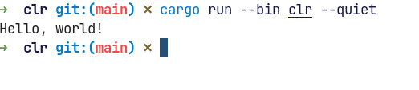
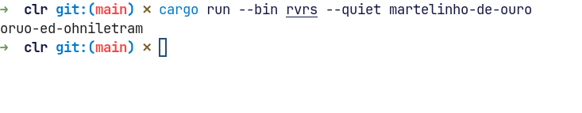
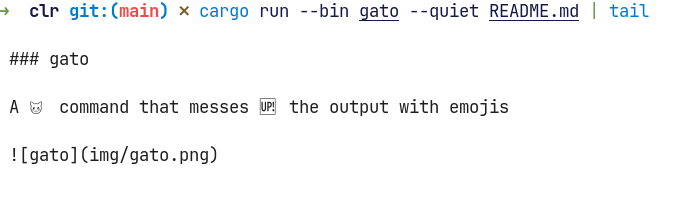
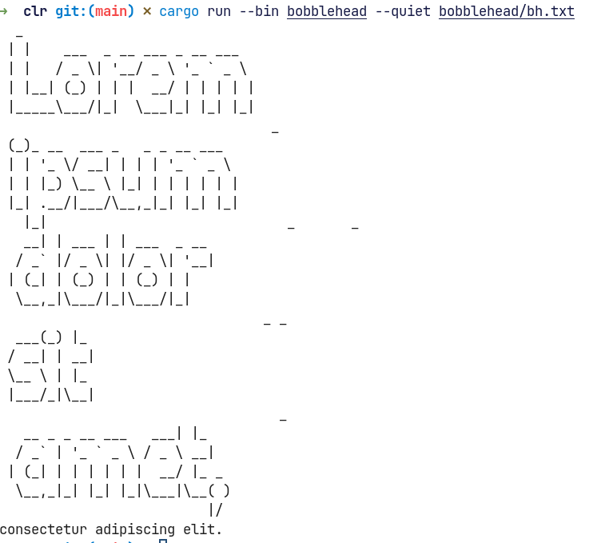

# cLr

This repository contains everything I found useful and practical in the `Command-Line Rust` book + other things.

## Commands

### clr

Does nothing, although it contains tests

### rvrs

An echo command that shows in reverse

### gato

A cat command that messes up the output with emojis

### bobblehead

A head command with big head

### toilet

A wc command that flushes depending on the amount of text

> Fedora: sudo dnf install alsa-lib-devel
